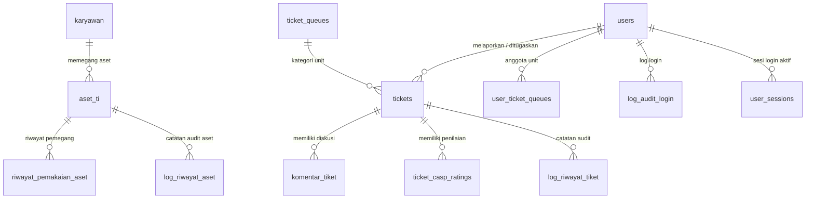

# ESB TrackIT — IT Assets Monitoring, Helpdesk & Help Center

**ESB TrackIT** adalah platform Enterprise IT Asset Monitoring, Helpdesk Support Queue, dan Help Center (Knowledge Base) modern yang dirancang untuk mengelola inventaris perangkat TI perusahaan, tracking riwayat pemakaian aset karyawan, sistem manajemen tiket bantuan, serta portal pusat panduan (SOP & FAQ) yang dapat dikelola melalui CMS admin.

---

## 🚀 Fitur Utama & Modul Sistem

### 1. 💻 Asset Management (Manajemen Aset TI)
- **Master Data Aset TI**: Tracking lengkap hostname, nomor seri, spesifikasi, tipe perangkat (laptop, PC, server, dsb.), merek, model, lokasi, dan pemegang aset.
- **Aset TI / GA / Ops**: Tiga kategori aset terpisah (`aset_ti`, `aset_ga`, `aset_ops`) dengan endpoint kanonik (`/api/assets`, `/api/ga-assets`, `/api/ops-assets`) + alias backward-compatible.
- **Kondisi & Status Aset**: Pengelolaan status (*In Use*, *Stock*, *Damaged*, *In Service*, *Disposal*) dan kondisi fisik (*Baru*, *Normal*, *Rusak Ringan/Sedang/Berat*).
- **Riwayat Pemakaian & Audit Log**: Catatan otomatis penyerahan/pengembalian aset ke karyawan serta log riwayat aktivitas perubahan data aset.

### 2. 👥 Employee Management (Master Data Karyawan)
- Database karyawan perusahaan (NIK, nama, departemen, direktorate, jabatan, lokasi kerja, email kantor, status kerja Permanent/Contract).
- Relasi hirarki atasan langsung (*NIK Atasan Langsung*) untuk eskalasi dan approval.
- Sinkronisasi otomatis akun user saat import data karyawan dari Excel.

### 3. 🎫 Helpdesk Support Queue & Issue Inbox (Sistem Tiket)
- **Quiet Modern SaaS Inbox Interface**: Antarmuka antrean tiket modern berstandar *Linear / Vercel / Raycast* dengan arsitektur 2-level informasi tanpa visual noise berlebihan.
- **Ticket Queues (Unit Support)**: Pengelompokan tiket berdasarkan unit tujuan (*IT Helpdesk*, *Network Team*, *Software Support*, *Hardware Support*).
- **Multi-Role Workspace**:
  - **User / Reporter**: Membuat request tiket (*+ Request Ticket*), memantau progress kendala, berdiskusi (dengan lampiran gambar), dan memberikan penilaian kepuasan (CASP).
  - **Admin & Superadmin**: Mengambil tiket (*Claim Ticket*), menetapkan penanggung jawab (*Assignee*), memperbarui status (*Open → In Progress → Pending → Resolved → Closed*), serta memantau SLA.
- **SLA & Timer Tracking**: Penghitungan mundur SLA berdasarkan tingkat prioritas (*Urgent: 4h*, *High: 1d*, *Medium: 3d*, *Low: 7d*).
- **Draft & Undo**: Dukungan draft tiket dan undo aksi untuk pengalaman inbox modern.

### 4. ⭐ CASP Assessment (Customer Satisfaction Rating)
- Evaluasi kepuasan pengguna setelah tiket diselesaikan (*Resolved / Closed*).
- Rating bintang 1–5 (*Sangat Tidak Puas* s.d. *Sangat Puas*) dan feedback ulasan singkat.
- Statistik & tren CASP per queue (`/api/tickets/casp/stats`, `/api/tickets/casp/trend`).
- Validasi eligibility reaktif dan real-time tanpa memerlukan browser refresh.

### 5. 📚 Help Center & Knowledge Base (CMS Admin)
- **Help Center Publik**: Landing page pencarian (*HomeView*) dengan live autocomplete dari DB, browse topics per kategori, FAQ accordion, dan pembaca dokumen bergaya Notion (*CaseReader*) dengan checklist langkah, DOs & DON'Ts, serta code snippet yang bisa dicopy.
- **Knowledge Base CMS** (`/admin/cases`): Dashboard admin untuk mengelola dokumen SOP/panduan — statistik real dari DB (Total, Published, Custom), pencarian, filter kategori & status, tabel CRUD dengan aksi menu.
- **Dokumen Editor** (`/admin/editor`): Rich text editor berbasis **TipTap** (heading, bold/italic/underline, list, blockquote, code block, link, placeholder) + Inspector panel untuk metadata (kategori, severity, tag). Seluruh isi dokumen — termasuk rich text `content_html` — tersimpan ke PostgreSQL.
- **FAQ CMS** (`/faqs`): Kelola pertanyaan umum dengan status DRAFT/PUBLISHED; hanya PUBLISHED yang tampil di publik.
- **Workflow Publikasi**: Dokumen DRAFT hanya terlihat admin; Publish membuat dokumen tampil di Help Center publik.

### 6. 📊 Analytics & Reporting
- **Dashboard** statistik aset & tiket dengan visualisasi **Chart.js** (`vue-chartjs`).
- **KB Analytics** (`/kb-analytics`) untuk memantau performa Knowledge Base.
- **Export Center** (`/export`): Export data aset, users, tiket, dan tabel arbitrer ke Excel (khusus Superadmin, dengan rate limit khusus).

### 7. 🔄 Real-Time SSE (Server-Sent Events) & Audit Trail
- Push notification & update status tiket secara real-time via Server-Sent Events (`/api/tickets/events`).
- Log riwayat perubahan tiket (*Activity Timeline*) dan log audit login pengguna untuk keandalan keamanan.

### 8. 🧰 Utilitas Admin
- **Import Excel**: Import massal data karyawan/aset/user dengan normalisasi & sinkronisasi akun otomatis.
- **Backup & Restore Database**: Manajemen backup PostgreSQL melalui UI admin (`DatabaseView`) — buat, unduh, hapus, validasi, dan restore backup beserta audit log-nya.
- **Activity Logs**: Log aktivitas sistem dan audit login.
- **Reset Password OTP**: Lupa password berbasis OTP (hash, expiry, attempt limit) dengan notifikasi email.

---

## 🛠️ Teknologi & Arsitektur

### Frontend (`frontend/`)
- **Framework**: Vue 3 (Composition API `<script setup>`), Vue Router dengan guard RBAC.
- **Styling**: TailwindCSS v4 + custom design tokens, dark mode, animasi **GSAP** (stagger entrance, hormat `prefers-reduced-motion`).
- **Rich Text Editor**: TipTap v3 (StarterKit: heading, bold/italic/underline, lists, blockquote, code block, link, placeholder, bubble menu).
- **Charts**: Chart.js + vue-chartjs.
- **Icons**: Lucide (`lucide-vue-next`).
- **Build Tool**: Vite.
- **Quality**: ESLint + oxlint + Prettier, `node --test`.

### Backend (`backend/`)
- **Runtime & Server**: Node.js (ES Modules), **Express 5**.
- **Database**: PostgreSQL dengan `pg` Connection Pool & Client Transactions.
- **Keamanan**:
  - JWT Authentication + validasi sesi server-side (`user_sessions` — SID UUID, expiry, revoke).
  - Bcrypt password hashing (rounds dapat dikonfigurasi 10–14).
  - RBAC (Role-Based Access Control) & scope queue security, proteksi IDOR.
  - Request field whitelist validation (`assertAllowedFields`).
  - Rate limiting berlapis (global API, auth, export), security headers, CORS exact allowlist (tanpa wildcard), validasi origin/CSRF, trusted proxy CIDR.
  - Proteksi brute-force login (`account_security_state` — lockout otomatis).
- **Real-Time**: Server-Sent Events (SSE) untuk update tiket.
- **Email**: Nodemailer (notifikasi & OTP reset password).
- **File Upload**: Multer (lampiran komentar tiket & file backup restore).
- **Migrasi**: Versioned SQL migrations dengan ledger `app_schema_migrations` (checksum SHA-256, advisory lock, recovery proof) diikuti `verifyRuntimeSchema` saat server start; startup tidak menjalankan DDL.

### Testing & QA
- **Backend tests**: `node --test` — 25+ file test (keamanan, IDOR, session lifecycle, rate limiting, import/export, GA/Ops assets, dsb.).
- **Frontend tests**: `node --test`.
- **E2E**: Playwright (`e2e/`) — auth, assets (TI/GA/Ops), tickets (create/lifecycle/CASP/draft/undo/unclaim/search/permission), RBAC, dashboard, negative scenarios, accessibility (`@axe-core/playwright`), dan QA extended.
- **CI/CD**: GitHub Actions — `ci.yml` (backend & frontend CI: syntax check, lint, format, unit tests) dan `e2e-tests.yml` (Playwright + PostgreSQL service).

---

## 🗄️ Skema Database (PostgreSQL)

Database default `assets_monitoring` (dapat diubah via `DB_NAME`, contoh: `esb_trackit`) terdiri dari tabel-tabel utama berikut:



### Daftar Tabel Utama

1. **`karyawan`**: Data master karyawan perusahaan (NIK, Nama, Departemen, Email, Status).
2. **`users`**: Akun pengguna sistem & otentikasi (Role: `user`, `admin`, `superadmin`, Hashed Password, Permissions JSONB).
3. **`user_sessions`**: Sesi login server-side (SID UUID, expiry, revoke) — divalidasi middleware JWT di setiap request.
4. **`account_security_state`**: State keamanan akun untuk proteksi brute-force (failed attempts, lockout).
5. **`password_reset_otps`**: OTP reset password (hash, expiry, attempts).
6. **`aset_ti`**: Master data inventaris aset TI (Hostname, Serial Number, Spesifikasi, Status, Kondisi, NIK Pemegang).
7. **`aset_ga`**: Inventaris aset General Affairs.
8. **`aset_ops`**: Inventaris aset Operations.
9. **`ticket_queues`**: Unit/tim helpdesk (Kode, Nama Unit, Status Aktif).
10. **`tickets`**: Tabel utama tiket bantuan (Nomor Tiket, Judul, Deskripsi, Prioritas, Status, Queue ID, Pelapor, Assignee, SLA).
11. **`komentar_tiket`**: Utasan diskusi dan lampiran gambar pada tiket.
12. **`ticket_casp_ratings`**: Penilaian kepuasan CASP (Rating 1–5 & Feedback) per tiket.
13. **`user_ticket_queues`**: Mapping penugasan admin ke unit helpdesk tertentu.
14. **`log_riwayat_tiket`**: Audit trail riwayat pergerakan & perubahan status tiket.
15. **`log_riwayat_aset`**: Audit trail perubahan data & mutasi aset TI.
16. **`riwayat_pemakaian_aset`**: History pemegang aset TI dari waktu ke waktu.
17. **`log_audit_login`**: Record aktivitas login pengguna (IP Address, User Agent, Status Login, Timestamp).
18. **`faq`**: Help Center FAQ (question, answer, category, status DRAFT/PUBLISHED, sort_order).
19. **`cases`**: Knowledge Base SOP/panduan (title, category, severity, tags, summary, problem_context, **content_html** rich text TipTap, action_steps, dos, donts, snippets, status, is_custom, sort_order).
20. **`backup_metadata` & `backup_audit_log`**: Metadata backup database dan audit operasi backup/restore.
21. **`app_schema_migrations`**: Ledger versioned migrations (checksum SHA-256, recovery proof).

### Database Views

- **`daftar_aset_ti_lengkap`**: View agregasi detail aset TI beserta informasi karyawan pemegang.
- **`v_ticket_stats_per_queue`**: View rekapitulasi statistik tiket open/closed per unit helpdesk.
- **`v_employee_asset_summary`**: View ringkasan jumlah aset TI yang dipegang oleh masing-masing karyawan.

---

## 📡 API Endpoint Utama

| Endpoint | Auth | Fungsi |
|---|---|---|
| `POST /api/auth/login` | Public | Login (JWT + session server-side) |
| `POST /api/auth/logout`, `GET /api/auth/me`, `POST /api/auth/change-password` | JWT | Manajemen sesi & password |
| `POST /api/auth/forgot-password`, `/verify-reset-otp`, `/reset-password` | Public | Reset password berbasis OTP |
| `GET /api/cases/public` | Public | Dokumen Knowledge Base berstatus PUBLISHED |
| `GET/POST/PUT/DELETE /api/cases/:id?` | JWT (Admin) | CRUD penuh Knowledge Base (CMS) |
| `GET /api/faqs/public` | Public | FAQ berstatus PUBLISHED |
| `GET/POST/PUT/DELETE /api/faqs/:id?` | JWT (Admin) | CRUD FAQ (CMS) |
| `GET/POST/PUT/DELETE /api/assets*` | JWT | Aset TI |
| `GET/POST/PUT/DELETE /api/ga-assets*` | JWT | Aset GA (alias: `/api/assets-ga`) |
| `GET/POST/PUT/DELETE /api/ops-assets*` | JWT | Aset Ops (alias: `/api/assets-ops`) |
| `GET/POST /api/tickets*` | JWT (User/Admin) | Tiket, komentar, lampiran, CASP rating |
| `GET /api/tickets/events` | JWT | Stream SSE update tiket real-time |
| `POST /api/tickets/:id/claim`, `/reassign` | JWT (Admin) | Claim & reassignment tiket |
| `GET /api/ticket-queues*` | JWT | Master unit helpdesk |
| `GET/POST/PUT/DELETE /api/employees*` | JWT (Admin) | Master karyawan (alias legacy: `/api/karyawan`) |
| `GET/POST/PUT/DELETE /api/users*` | JWT (Admin) | Manajemen akun pengguna |
| `GET /api/logs*` | JWT (Admin) | Activity & audit logs |
| `POST /api/import/excel` | JWT (Admin) | Import massal dari Excel |
| `GET /api/export/*` | JWT (Superadmin) | Export aset/users/tiket/tabel ke Excel |
| `GET/POST/DELETE /api/admin/database/*` | JWT (Superadmin) | Backup, restore, status & audit database |
| `GET /health` | Public | Health check |

> Validasi payload ketat di setiap controller (`assertAllowedFields` — field di luar whitelist ditolak 400). Semua endpoint selain `/health`, login/reset-password, dan endpoint `/public` memerlukan cookie sesi HttpOnly `esb_session`. Browser memakai `credentials: 'include'`; token tidak disimpan di localStorage atau dikirim melalui header Authorization.

---

## 📁 Struktur Direktori Project

```text
it-monitoring-assets/
├── .github/workflows/       # CI/CD: ci.yml (backend+frontend CI), e2e-tests.yml (Playwright)
├── backend/                 # Node.js + Express 5 + PostgreSQL API Server
│   ├── migrations/          # Versioned SQL migrations (001–004) + cases_seed.json
│   ├── storage/             # Penyimpanan file (lampiran, backup)
│   ├── src/
│   │   ├── config/          # Env, database, runtime schema check, seed, migration runner
│   │   ├── controllers/     # Validasi, query, request, response (asset, ticket, case, faq, backup, dsb.)
│   │   ├── errors/          # Canonical error schema
│   │   ├── middleware/      # Auth JWT + session, RBAC, rate limit, origin/CSRF, security headers
│   │   ├── routes/          # Daftar URL dan HTTP method (index.js: canonical + alias)
│   │   ├── security/        # Password service, request validation, CORS & authorization policy
│   │   ├── services/        # Permission, session, ticket access, email/OTP, realtime SSE, backup
│   │   ├── assets/          # Aset statis backend
│   │   ├── utils/           # Helper utilities
│   │   ├── app.js           # Konfigurasi aplikasi Express
│   │   └── server.js        # Entry point + bootstrap tabel runtime
│   └── tests/               # Automated test (node --test) — 25+ security & feature tests
├── frontend/                # Vue 3 + Vite Single Page Application
│   ├── public/
│   ├── tests/               # Frontend tests (node --test)
│   └── src/
│       ├── views/           # Halaman (Home, Cases, Tickets, Assets TI/GA/Ops, Dashboard,
│       │                    #   Analytics, Employees, Users, Logs, Export, Database, admin/ CMS & Editor)
│       ├── components/      # UI components (cases/, admin/, charts/, tickets/, layout/, ui/, common/)
│       ├── composables/     # useApi, useAuth, useCases, useGsap, useToast, useTicketRealtime, dsb.
│       ├── services/        # api.js (REST client dengan Bearer token)
│       ├── router/          # Vue Router + guard RBAC
│       └── utils/
├── e2e/                     # Playwright End-to-End Test Automation Suite
│   ├── fixtures/            # Auth fixture & test data
│   ├── helpers/             # API helper & cleanup
│   ├── pages/               # Page Object Model (TicketListPage)
│   └── tests/               # auth, assets, tickets, rbac, dashboard, negative,
│                            #   accessibility, qa-extended
├── deploy/                  # Konfigurasi deployment (nginx-esb-trackit.conf)
├── docs/                    # Dokumentasi project, audits, presentation, QA prompts & reports
├── scripts/qa/              # Reusable QA utility scripts (report generator, a11y, db integrity)
├── qa-reports/              # Hasil laporan QA
├── playwright.config.js     # Global Playwright configuration (auto-start backend+frontend)
├── .env.e2e.example         # Contoh environment untuk E2E testing
├── package.json             # Root workspace manifest & E2E commands
└── README.md
```

---

## ⚡ Instalasi & Cara Menjalankan

### Prasyarat
- **Node.js**: v22.18+ atau v24.12+ (sesuai `engines` di `package.json`)
- **PostgreSQL**: v14.x atau versi lebih baru

### 1. Setup Database PostgreSQL
1. Buat database baru (default: `assets_monitoring`, atau `esb_trackit`):
   ```sql
   CREATE DATABASE esb_trackit;
   ```
2. Jalankan skema & migrasi versioned canonical:
   ```bash
   cd backend
   npm run db:migrate:plan
   npm run db:migrate:apply
   npm run db:check
   ```
3. (Opsional) Seed data awal Knowledge Base:
   ```bash
   cd backend
   node src/config/seedCases.js
   ```

### 2. Setup Server Backend
1. Masuk ke direktori `backend/`:
   ```bash
   cd backend
   ```
2. Install dependensi:
   ```bash
   npm install
   ```
3. Buat file `.env` di folder `backend/`. **Wajib** mengisi `DB_PASSWORD` dan `JWT_SECRET` (min. 32 karakter) — tanpa fallback default demi keamanan:
   ```env
   PORT=3000
   DB_HOST=localhost
   DB_PORT=5432
   DB_NAME=esb_trackit
   DB_USER=postgres
   DB_PASSWORD=your_secure_db_password
   JWT_SECRET=your_very_long_random_secret_key_min_32_chars

   # Opsional
   # CORS_ORIGINS=http://localhost:5173,http://127.0.0.1:5173
   # DB_SSL=false
   # API_RATE_LIMIT_WINDOW_MS=60000
   # API_RATE_LIMIT_MAX=150
   # AUTH_RATE_LIMIT_MAX=20
   # EXPORT_RATE_LIMIT_MAX=10
   # PASSWORD_BCRYPT_ROUNDS=12
   # TRUST_PROXY_CIDRS=127.0.0.1
   ```
4. Jalankan server backend:
   ```bash
   npm run dev      # Development (nodemon, watch .env & src)
   npm start        # Production
   ```
   *Server backend berjalan di `http://localhost:3000` secara default (ubah via `PORT`). Saat start, server otomatis mem-bootstrap tabel runtime yang belum ada (`backup_metadata`, `faq`, `cases`, dsb.) dan memverifikasi skema via `verifyRuntimeSchema`.*

### 3. Setup Client Frontend
1. Masuk ke direktori `frontend/`:
   ```bash
   cd frontend
   ```
2. Install dependensi:
   ```bash
   npm install
   ```
3. Jalankan server pengembang frontend:
   ```bash
   npm run dev
   ```
   *Aplikasi web frontend berjalan di `http://localhost:5173`.*
4. Build production:
   ```bash
   npm run build && npm run preview
   ```

### 4. Testing

```bash
# Dari root project
npm run test:backend       # Backend unit/integration tests (node --test)
npm run test:frontend      # Frontend tests (node --test)
npm run test:e2e           # Playwright end-to-end suite (auto-start backend+frontend)
npm run test:e2e:smoke     # E2E smoke tests saja (@smoke)
npm run test:e2e:headed    # E2E dengan browser terlihat
npm run test:e2e:ui        # E2E Playwright UI mode
npm run test:e2e:report    # Tampilkan HTML report Playwright
```

> Untuk E2E, salin `.env.e2e.example` menjadi `.env.e2e` dan sesuaikan kredensial test (URL backend/frontend, akun superadmin/admin/user, koneksi DB). Konfigurasi `playwright.config.js` akan menyalakan server backend & frontend secara otomatis.

### 5. Lint & Format (Frontend)

```bash
cd frontend
npm run lint           # ESLint + oxlint check
npm run lint:fix       # Auto-fix
npm run format:check   # Prettier check
npm run format         # Prettier write
```

---

## 🚀 Deployment

- Reverse proxy contoh tersedia di `deploy/nginx-esb-trackit.conf`.
- CI/CD pipeline via GitHub Actions:
  - **`.github/workflows/ci.yml`**: Backend CI (syntax & preflight check, unit tests) + Frontend CI (lint, format check, unit tests).
  - **`.github/workflows/e2e-tests.yml`**: E2E Playwright dengan PostgreSQL service container.

---

## 🔐 Manajemen Akses & Akun Bootstrap

Sistem ini tidak menggunakan kredensial bawaan hardcoded pada dokumentasi.

Akun administrator / Superadmin pertama wajib diprovisi melalui mekanisme admin provisioning (`backend/src/config/seedUsers.js`) atau skrip deployment resmi pada lingkungan yang diotorisasi.

Hak akses per halaman dievaluasi di dua lapis: router guard frontend (`permissionAccess`) dan middleware `authenticateToken` + `authorizeRoles` di backend, ditambah resource-level authorization (anti-IDOR) di sisi server.

---

## 📄 Lisensi

Hak Cipta © 2026 **ESB TrackIT**. Dikembangkan untuk sistem pemantauan aset TI dan helpdesk internal perusahaan.
